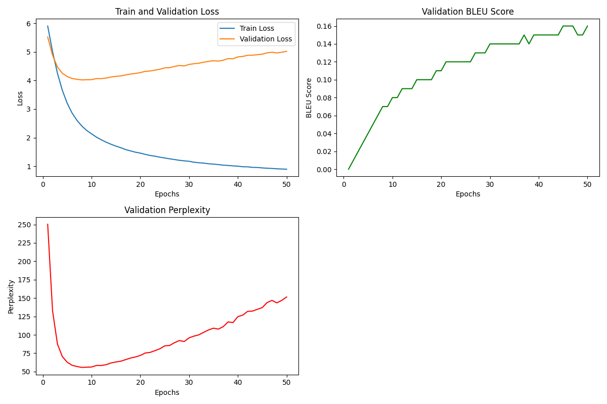

# Task 3 Report

## Model Configuration

1. Embedding Configuration

The embedding is trained using Word2Vec. Noted that we trained an unified embedding for both source and target languages. Detailed parameters are as follows:

```python
model = gensim.models.Word2Vec(train_corpus, vector_size=256, window=10, min_count=1, sg=1)
```

For more details, please refer to `./train_embedding.py`.

2. Model Configuration

The model is a sequence-to-sequence model with an encoder and a decoder. Detailed parameters are as follows:

```python
batch_size = 64
embedding_dim = 256
ENC_EMB_DIM = embedding_dim
DEC_EMB_DIM = embedding_dim
HID_DIM = 256
N_LAYERS = 2
ENC_DROPOUT = 0.5
DEC_DROPOUT = 0.5
N_EPOCHS = 50
CLIP = 1
```

For more details, please refer to `./train_model.py`.

## Training Details

The train and validation loss, along with the BLEU score and perplexity, are as follows:



For raw outputs, please refer to the last log in `./train_model.log`.

## Testing Details

Since the train loss and validation loss are both decreasing in the first 10 epochs and validation loss starts to increase after the 10th epoch, while the BLEU score increased throughout the training process, we choose the model trained by the 10th epoch and final epoch for testing.

The test output is:

```
Evaluating on Epoch 10...
Evaluating: 100%|█████████████████████████████████████████████████████████████████████████████████████████████████████████████████████████████████████████████████████████████████████████████████████████████████████████████████████████████████████████████████████████████████████████████████| 98/98 [00:04<00:00, 22.21it/s]
Validation Loss: 4.030 | Validation BLEU: 0.0779 | Validation Perplexity: 56.26
Evaluating: 100%|█████████████████████████████████████████████████████████████████████████████████████████████████████████████████████████████████████████████████████████████████████████████████████████████████████████████████████████████████████████████████████████████████████████████████| 98/98 [00:03<00:00, 30.67it/s]
Test Loss: 4.102 | Test BLEU: 0.0708 | Test Perplexity: 60.48

Testing specific sentences:
Japanese: 私の名前は愛です
English: name is name.

Japanese: 昨日はお肉を食べません
English: don't eat much yesterday.

Japanese: いただきますよう
English: you

Japanese: 秋は好きです
English: like monday!

Japanese: おはようございます
English: morning,

Evaluating on Epoch 50...
Evaluating: 100%|█████████████████████████████████████████████████████████████████████████████████████████████████████████████████████████████████████████████████████████████████████████████████████████████████████████████████████████████████████████████████████████████████████████████████| 98/98 [00:03<00:00, 31.16it/s]
Validation Loss: 4.989 | Validation BLEU: 0.1549 | Validation Perplexity: 146.82
Evaluating: 100%|█████████████████████████████████████████████████████████████████████████████████████████████████████████████████████████████████████████████████████████████████████████████████████████████████████████████████████████████████████████████████████████████████████████████████| 98/98 [00:03<00:00, 30.72it/s]
Test Loss: 5.087 | Test BLEU: 0.1514 | Test Perplexity: 161.96

Testing specific sentences:
Japanese: 私の名前は愛です
English: my name is

Japanese: 昨日はお肉を食べません
English: haven't eaten anything food yesterday.

Japanese: いただきますよう
English: take

Japanese: 秋は好きです
English: like the the

Japanese: おはようございます
English: wake
```

It can be observed that the model trained by the 10th epoch outputs more fluent sentences than the model trained by the 50th epoch. But the model trained by the 50th epoch outputs more accurate translations, which is aligned with the result that BLEU score of the model trained by the 50th epoch is higher than the model trained by the 10th epoch, while perplexity of the model trained by the 50th epoch is also higher than the model trained by the 10th epoch.

**Note**: The BLEU score we used is imported from `nltk` (to be specific, we used `from nltk.translate.bleu_score import corpus_bleu`). This BLEU score should multiply 100 to be consistent with the common BLEU score.

## Some Analysis

At the beginning 10 epochs, the translation is getting more and more fluent and accurate, which is indicated by the BLEU score and perplexity. However, after the 10th epoch, the translation results are becoming more accurate but less fluent. It seems that the model is overfitting the training data by memorizing the Japanese words and their counterparts in English. 