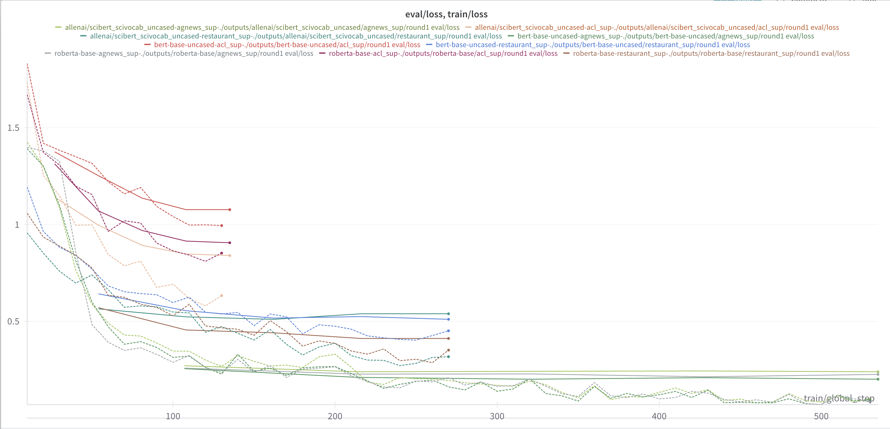
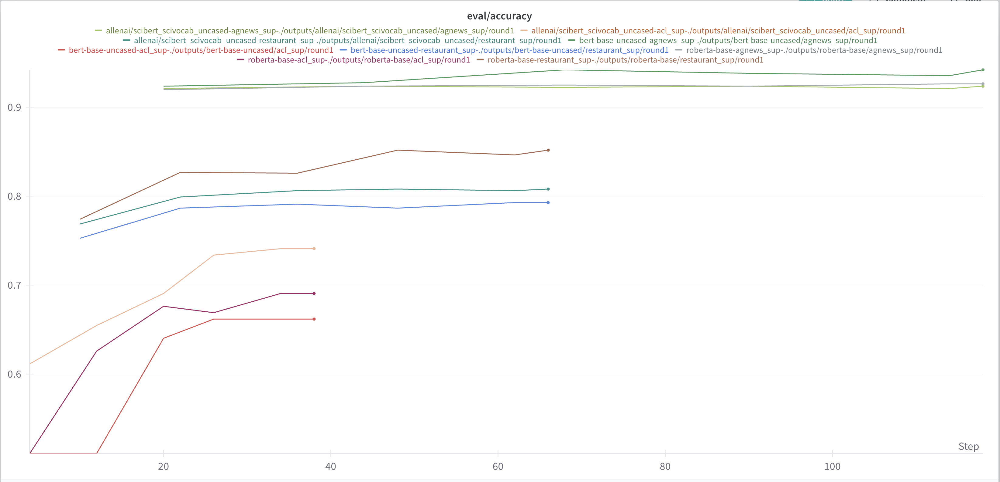
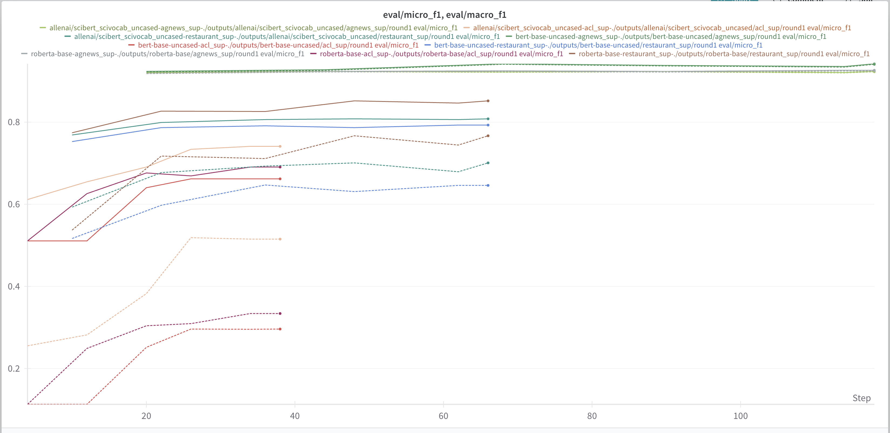
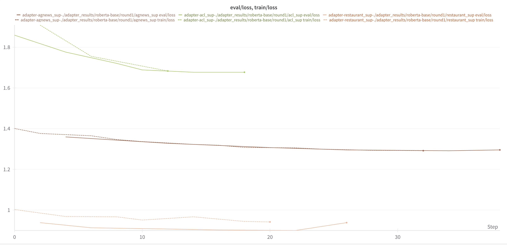
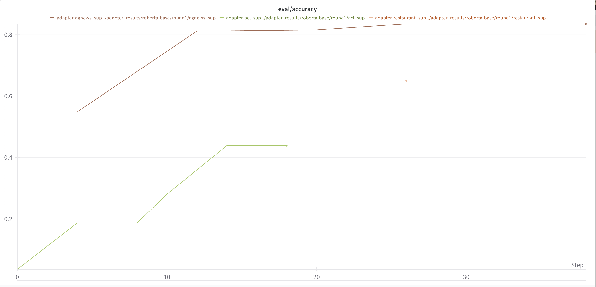
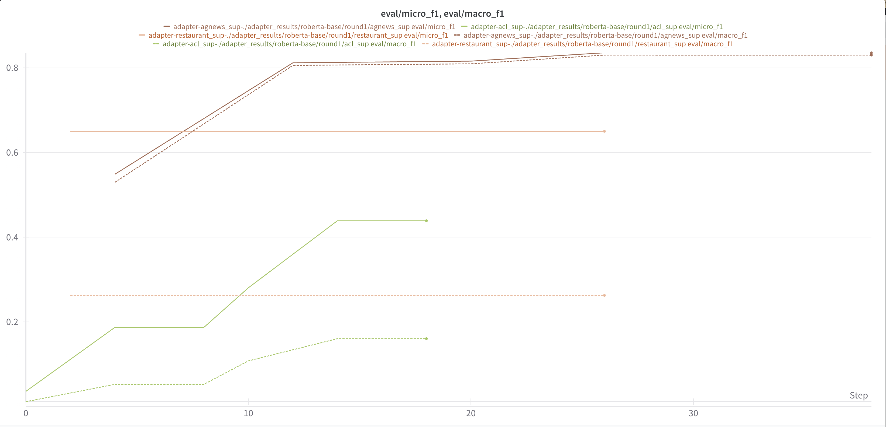

# Homework #2 Report

2200017789 楼翰涛

## Dataset Construction

For the detail of dataset construction, please refer to `dataHelper.py`.

## Full Parameter Training

We use the `trainer.py` file to train the model with full parameters, and the `train.sh` file to conduct batch training. Training hyperparameters can be found in the `train.sh` file:

```bash
python train.py \
    --model_name_or_path $model \
    --dataset_name $dataset \
    --output_dir ./outputs/${model}/${dataset}/round${round} \
    --num_train_epochs 5 \
    --per_device_train_batch_size 8 \
    --per_device_eval_batch_size 8 \
    --learning_rate 2e-5 \
    --warmup_ratio 0.05 \
    --weight_decay 0.01 \
    --logging_strategy steps \
    --logging_steps 10 \
    --evaluation_strategy epoch \
    --save_strategy epoch \
    --load_best_model_at_end True \
    --metric_for_best_model accuracy \
    --report_to wandb \
    --save_safetensors False
```

Here are the results:

Train and evaluation loss:


Evaluation accuracy:


Evaluation f1-score:


We performed 5 rounds of training on each settings, and the results are basically the same, so we only show the results of the first round.

Analysis:

1. The training process is generally stable, with the loss continuously decreasing and the accuracy continuously increasing on each models and datasets.
2. Generally, the performance of scibert and roberta is better than bert-base on each tasks, but the scibert and roberta's performance is very close, on acl_sup dataset, scibert's performance is slightly better than roberta's, whereas on restaurant_sup dataset, roberta's performance is slightly better than scibert's.
3. When comparing across datasets, acl_sup is the hardest, and agnews_sup is the easiest.
4. The training loss is aligned with evaluation accuracy and loss, which means the model is not overfitting, even when epoch is 5.


## Adapter Training

We define the adapter in the `adapter.py` file, and train the adapter in the `train_adapter.py` file. We use the `adapter_experiment.sh` file to conduct batch training. Training hyperparameters can be found in the `adapter_experiment.sh` file:

```bash
python adapter_train.py \
    --model_name_or_path roberta-base \
    --dataset_name $dataset \
    --output_dir ./adapter_results/roberta-base/round${round}/${dataset} \
    --num_train_epochs 5 \
    --per_device_train_batch_size 16 \
    --per_device_eval_batch_size 16 \
    --learning_rate 5e-4 \
    --warmup_ratio 0.05 \
    --weight_decay 0.01 \
    --logging_steps 10 \
    --evaluation_strategy epoch \
    --save_strategy epoch \
    --load_best_model_at_end true \
    --metric_for_best_model accuracy
```

Here are the results:

Train and evaluation loss:


Evaluation accuracy:


Evaluation f1-score:


We performed 5 rounds of training on each settings, and the results are basically the same, so we only show the results of the first round.

Analysis:

1. Compared to the full parameter training, the adapter training behaves worse on all tasks, which is inevitable.
2. The training process is generally stable, with the loss continuously decreasing and the accuracy continuously increasing on each models and datasets.
3. From observation, the adapter training costs around 50% GPU memory compared to that of full parameter training.
4. Answering the question in the handout: Directly finetune a 3B model without PEFT will take about 3*(2+2+6) = 30 GB, assuming that batch size is 1.

Conclusion:

From our experiment and theoretical analysis, we can conclude that PEFT is a more efficient way to finetune large models (both in terms of memory and FLOPs), though it may have some performance loss.